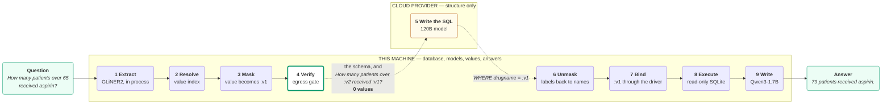

# NL2SQL

**Ask a database in plain English without disclosing it.**

A large cloud model writes excellent SQL, but using one means sending it the
question, and the question is about the data: it names a drug, an age, a ward. A
small local model discloses nothing and writes poor SQL.

This project takes the useful half of each. The cloud model receives the table
structure and the question with every value replaced by a symbol. It never
receives a value, a row, or an answer. The query runs locally, and the answer is
written locally by a 1.7-billion-parameter model on the CPU.

---

## The pipeline



The dotted arrows are the only two moments anything crosses the network. Between
them sits the gate: **exactly one module may open a socket, and every piece of
text it sends is verified first.**

---

## Four architectures, measured

The point of building the middle two is that the outer two bracket them.

| | Writes the SQL | Writes the answer | What is sent | Values sent |
|---|---|---|---|---|
| **Hybrid** | cloud, from symbols | local | schema and a masked question | **0** |
| **Hybrid Opaque** | cloud, from labels | local | labels only, no business word | **0** |
| Full Cloud | cloud, raw question | cloud | the question and every row | all of them |
| Full Local | local 1.7 B | local | nothing | 0 |

Full Cloud is the accuracy ceiling and the privacy floor. Full Local is the
opposite. The distance between them is what gives the two middle architectures a
meaning, and it is measured rather than asserted: notebook 3 runs all four on the
same questions and prints the table.

---

## How the protection actually works

**Resolve before you send.** A question says *aspirin*. The database stores
`ASPIRIN EC 81 MG PO TBEC`. A local index closes that gap and, just as
importantly, reports which column the value came from. That second half is what
lets the opaque architecture say `:v1 is a value of c7` without naming a drug or
a column.

**The index does not grow with the data.** Indexing every value would make the
cost scale with row count. Instead every text column is measured once and sorted:
bounded vocabularies are indexed in full, high-cardinality columns are searched
on demand, free text and identifiers are excluded. The stored size is
`columns x vocabulary limit`, so ten million more rows cost nothing as long as
the set of distinct values does not grow.

**Symbols are renumbered per request.** `:v1` in one question and `:v1` in the
next are unrelated, so no one watching the traffic can follow a value across two
questions.

**The gate checks by origin, not by hope.** The outgoing prompt is split into
segments and each is proven safe by the rule that fits it: authored text by
fingerprint, the schema by regenerating it from the database and comparing, the
glossary by membership, and only the masked question word by word.

**Values are bound, never interpolated.** The model returns
`WHERE drugname = :v1`. The value is bound here through the SQLite driver, so the
query text and the value never meet in a single string.

---

## The data

**eICU Collaborative Research Database v2.0.1** — 31 tables, 4.6 million rows of
de-identified intensive-care records, published by the MIT Laboratory for
Computational Physiology under an open licence. No private data is used anywhere
in this project.

The published export has no primary keys, no foreign keys and no indexes. The
build reconstructs all three, because the schema is the only thing the cloud
model ever sees: a model told how the tables join writes a correct query, and a
model left to guess guesses.

---

## Run it

Four notebooks on Kaggle. Notebook 1 builds everything and saves it; the rest
read that output and download nothing.

| | Notebook | What it does |
|---|---|---|
| 1 | [Setup](https://www.kaggle.com/code/kirazul/nl2sql-1-setup) | clones the code, downloads the models, builds the database and the index |
| 2 | [Understanding](https://www.kaggle.com/code/kirazul/nl2sql-2-understanding) | how a question is read, resolved and masked, before anything is sent |
| 3 | [Architectures](https://www.kaggle.com/code/kirazul/nl2sql-3-architectures) | the four designs, run and measured |
| 4 | [Run All](https://www.kaggle.com/code/kirazul/nl2sql-4-run-all) | the whole pipeline, then the live service |

Run notebook 1 once and **Save Version > Save & Run All**. Then open notebook 4
and press Run All.

**Secrets** go in *Add-ons > Secrets*. Kaggle grants access per notebook, so each
one has to be enabled where it is used.

| Secret | Needed by |
|---|---|
| `GITHUB_TOKEN` | all four, to clone this repository |
| `GROQ_API_KEY` | notebooks 3 and 4 |
| `OPENROUTER_API_KEY` | optional fallback |
| `LANGSMITH_API_KEY` | optional tracing |
| `PUBLISH_TOKEN` | notebook 4, for the live link |

### Locally

```bash
uv sync
cp .env.example .env               # then fill in the keys
python scripts/build_database.py   # downloads and prepares eicu.db
python scripts/build_value_index.py
bash scripts/download_models.sh
uvicorn hybridsql.api.app:app --port 7860
pytest
```

Each build step skips itself if its output is already there.

---

## The web interface

<https://nl2sql.eclipse-kira.workers.dev>

A Kaggle session has no stable address: the tunnel hostname changes on every
restart. So the notebook publishes its current address to a Cloudflare Worker and
the page reads it back.

The Worker does not carry the conversation. The browser connects straight to the
session, and the question, the SQL and the answer never pass through Cloudflare.
Proxying would have been easier, but this project's claim is that the data stays
inside a known boundary, and routing every answer through a third party to tidy
up a URL would have contradicted it.

The interface is live only while a notebook session is running.

---

## Layout

```
src/hybridsql/
  db/          schema reading, read-only connection, value index, column catalogue
  pipeline/    understand > anonymize > generate > opaque > answer
  providers/   cloud (the only outbound socket), extractor, local model
  security/    egress gate, SQL validator, audit journal
  graph/       the four architectures, as state machines
  api/         the REST service
notebooks/     the four Kaggle notebooks, generated by scripts/build_notebooks.py
deploy/worker/ the web interface and its Cloudflare Worker
scripts/       build the database, the index, the notebooks, the diagrams
docs/          guide, architecture, decisions, indexing, walkthrough, schema reference
tests/         unit tests and the leak canaries
```

The notebooks are generated, not edited. A `.ipynb` is JSON with every line of
source escaped into a string array, and edited by hand they rot. One source file
writes all four:

```bash
python scripts/build_notebooks.py           # write them
python scripts/build_notebooks.py --push    # and upload to Kaggle
```

---

## Documentation

| | |
|---|---|
| [`docs/GUIDE.md`](docs/GUIDE.md) | start here, the whole project from zero |
| [`docs/00-PROJECT.md`](docs/00-PROJECT.md) | what it is, what is built, what is measured |
| [`docs/01-ARCHITECTURE.md`](docs/01-ARCHITECTURE.md) | the trust boundary, the stages, the gate |
| [`docs/02-DECISIONS.md`](docs/02-DECISIONS.md) | every choice, and why |
| [`docs/03-INDEXING.md`](docs/03-INDEXING.md) | what is indexed, what is not, how it scales |
| [`docs/04-WALKTHROUGH.md`](docs/04-WALKTHROUGH.md) | one real question, stage by stage |
| [`docs/schema-reference.pdf`](docs/schema-reference.pdf) | every table and every column, explained — generated from the database |

---

## Licence

eICU Collaborative Research Database v2.0.1 — Open Data Commons ODbL v1.0.
